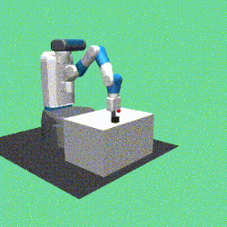
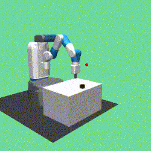
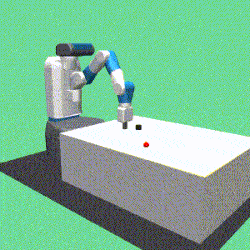

# Episodic Self-Imitation Learning with Hindsight (ESIL)
This is the official code of our paper "[Episodic Self-Imitation Learning with Hindsight](https://www.mdpi.com/2079-9292/9/10/1742)".

FetchPush-v1| FetchPickAndPlace-v1| FetchSlide-v1
-----------------------|-----------------------|-----------------------|
| | |

## Requirements
- python=3.6.8
- pytorch=1.0.1
- mujoco-py=1.50.1.56
- gym=0.12.1
- mpi4py=3.0.1

## Installation:
Install the OpenMPI on the machine.
```bash
sudo apt-get install openmpi-bin openmpi-doc libopenmpi-dev
```
## Instructions
- run the **FetchReach-v1**:
```bash
mpirun -np 16 python train.py --env-name='FetchReach-v1' --adaptive-beta --display-interval=1 --total-frames=250000

```
- run the **FetchPush-v1**:
```bash
mpirun -np 16 python train.py --env-name='FetchPush-v1' --adaptive-beta --display-interval=1 --total-frames=2500000

```
- run the **FetchPickAndPlace-v1**:
```bash
mpirun -np 32 python train.py --env-name='FetchPickAndPlace-v1' --adaptive-beta --display-interval=1 --batch-size=40 --ncycles=100 --total-frames=5000000

```
- run the **FetchSlide-v1**:
```bash
mpirun -np 32 python train.py --env-name='FetchSlide-v1' --adaptive-beta --display-interval=1 --batch-size=40 --ncycles=100 --total-frames=5000000

```
- run the demo (e.g. **FetchPickAndPlace**), pretrained models is available from [Google Driver](https://drive.google.com/file/d/1Nyi_HVSAX4TnDiQA3Dk19QjojMUr3s3R/view?usp=sharing):
```bash
python demo.py --env-name='FetchPickAndPlace-v1' --render

```
## BibTex
To cite this code for publications - please use:
```
@article{dai2020esil,
  title={Episodic Self-Imitation Learning with Hindsight},
  author={Dai, Tianhong and Liu, Hengyan and Bharath, Anil Anthony},
  journal={Electronics},
  volume={9},
  number={10},
  pages={1742},
  year={2020},
  publisher={Multidisciplinary Digital Publishing Institute}
}

```
